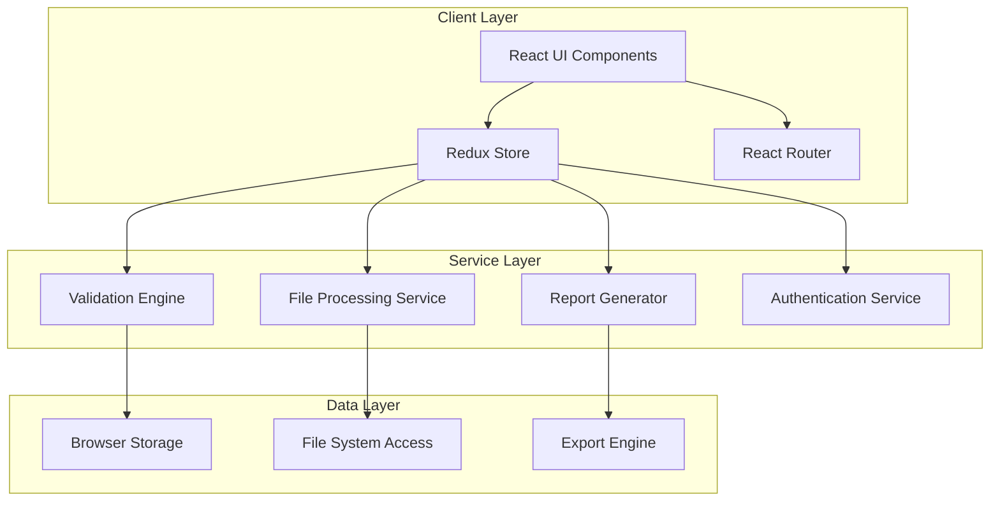
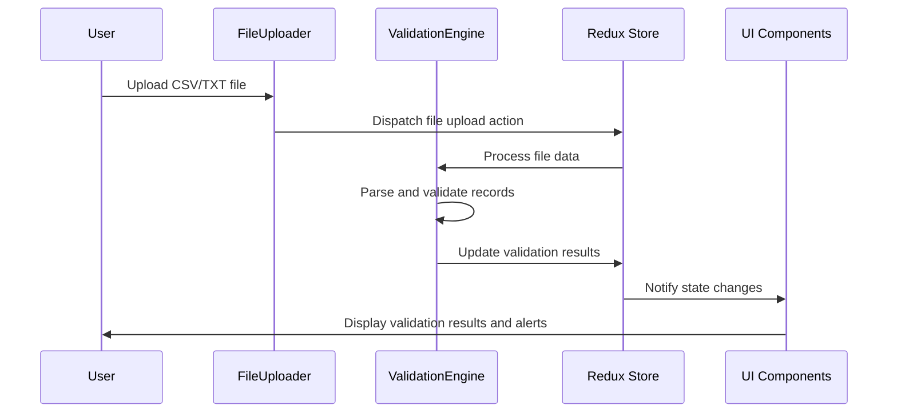

# Design Document

## Overview

The Invoice and Credit Note Validation System is a React-based web application that provides automated validation of financial documents. The system follows a component-based architecture using modern web technologies to ensure scalability, maintainability, and user experience. The application supports file upload processing, real-time validation, discrepancy detection, and comprehensive reporting capabilities.

## Architecture

### High-Level Architecture



### Technology Stack Integration

- **React 18+**: Component-based UI with hooks for state management
- **Redux Toolkit**: Centralized state management with RTK Query for data fetching
- **TailwindCSS + Shadcn UI**: Consistent design system and component library
- **React Router v6**: Client-side routing with nested routes
- **File API**: Browser-native file processing capabilities
- **Web Workers**: Background processing for large file validation

## Components and Interfaces

### Core Components Structure

```
src/
├── components/
│   ├── ui/                    # Shadcn UI base components
│   │   ├── Button.jsx
│   │   ├── Input.jsx
│   │   ├── Alert.jsx
│   │   └── DataTable.jsx
│   ├── layout/
│   │   ├── Header.jsx
│   │   ├── Sidebar.jsx
│   │   └── Layout.jsx
│   ├── file-upload/
│   │   ├── FileUploader.jsx
│   │   ├── FileValidator.jsx
│   │   └── UploadProgress.jsx
│   ├── validation/
│   │   ├── ValidationDashboard.jsx
│   │   ├── DiscrepancyAlert.jsx
│   │   └── ValidationResults.jsx
│   └── reports/
│       ├── ReportGenerator.jsx
│       ├── ReportFilters.jsx
│       └── ExportOptions.jsx
```

### Key Interface Definitions

```typescript
// File Processing Interfaces
interface FileUploadData {
  id: string;
  filename: string;
  type: 'csv' | 'txt';
  size: number;
  status: 'pending' | 'processing' | 'completed' | 'error';
  records: InvoiceRecord[];
}

interface InvoiceRecord {
  id: string;
  invoiceNumber: string;
  customerName: string;
  amount: number;
  taxAmount: number;
  totalAmount: number;
  date: string;
  status: 'valid' | 'invalid' | 'pending';
}

// Validation Interfaces
interface ValidationResult {
  recordId: string;
  field: string;
  originalValue: number;
  calculatedValue: number;
  discrepancy: number;
  severity: 'low' | 'medium' | 'high';
}

interface ValidationSummary {
  totalRecords: number;
  validRecords: number;
  invalidRecords: number;
  totalDiscrepancies: number;
  highSeverityCount: number;
}
```

### Page Components

```
src/pages/
├── Dashboard.jsx              # Main dashboard with validation overview
├── MasterData/
│   ├── ImportData.jsx        # Data import functionality
│   └── ExportData.jsx        # Data export functionality
├── Components/
│   ├── Customers.jsx         # Customer management
│   ├── Products.jsx          # Product management
│   ├── Invoices.jsx          # Invoice processing and validation
│   ├── CreditNotes.jsx       # Credit note processing
│   └── Reports.jsx           # Report generation and viewing
├── Roles/
│   └── UserManagement.jsx    # User role and permission management
└── Settings/
    └── TermsConditions.jsx   # Terms and conditions display
```

## Data Models

### Redux Store Structure

```typescript
interface RootState {
  auth: {
    user: User | null;
    permissions: Permission[];
    isAuthenticated: boolean;
  };
  files: {
    uploads: FileUploadData[];
    processing: boolean;
    error: string | null;
  };
  validation: {
    results: ValidationResult[];
    summary: ValidationSummary;
    alerts: DiscrepancyAlert[];
    isValidating: boolean;
  };
  reports: {
    generated: Report[];
    filters: ReportFilters;
    isGenerating: boolean;
  };
  ui: {
    sidebarOpen: boolean;
    theme: 'light' | 'dark';
    notifications: Notification[];
  };
}
```

### File Processing Data Flow



## Error Handling

### Error Categories and Handling Strategy

1. **File Processing Errors**
   - Invalid file format: Display user-friendly error message with supported formats
   - File size exceeded: Show size limit and suggest file splitting
   - Parsing errors: Highlight specific rows/columns with issues

2. **Validation Errors**
   - Calculation failures: Log error details and mark record as requiring manual review
   - Data type mismatches: Provide clear field-level error messages
   - Missing required fields: Guide user to complete missing information

3. **System Errors**
   - Network failures: Implement retry mechanisms with exponential backoff
   - Memory limitations: Use pagination and virtual scrolling for large datasets
   - Browser compatibility: Graceful degradation for unsupported features

### Error Boundary Implementation

```typescript
// Global error boundary for React components
class ErrorBoundary extends React.Component {
  constructor(props) {
    super(props);
    this.state = { hasError: false, error: null };
  }

  static getDerivedStateFromError(error) {
    return { hasError: true, error };
  }

  componentDidCatch(error, errorInfo) {
    // Log error to monitoring service
    console.error('Application Error:', error, errorInfo);
  }

  render() {
    if (this.state.hasError) {
      return <ErrorFallback error={this.state.error} />;
    }
    return this.props.children;
  }
}
```

## Testing Strategy

### Testing Pyramid Approach

1. **Unit Tests (70%)**
   - Component rendering and props handling
   - Utility functions and calculations
   - Redux reducers and actions
   - File parsing logic

2. **Integration Tests (20%)**
   - File upload and processing workflow
   - Validation engine with different data types
   - Report generation end-to-end
   - User authentication and authorization

3. **End-to-End Tests (10%)**
   - Complete user workflows from file upload to report generation
   - Cross-browser compatibility testing
   - Performance testing with large datasets
   - Accessibility compliance testing

### Testing Tools and Configuration

```typescript
// Jest configuration for unit tests
module.exports = {
  testEnvironment: 'jsdom',
  setupFilesAfterEnv: ['<rootDir>/src/setupTests.js'],
  moduleNameMapping: {
    '^@/(.*)$': '<rootDir>/src/$1',
  },
  collectCoverageFrom: [
    'src/**/*.{js,jsx}',
    '!src/index.js',
    '!src/reportWebVitals.js',
  ],
  coverageThreshold: {
    global: {
      branches: 80,
      functions: 80,
      lines: 80,
      statements: 80,
    },
  },
};

// React Testing Library setup
import '@testing-library/jest-dom';
import { configure } from '@testing-library/react';

configure({ testIdAttribute: 'data-testid' });
```

### Performance Considerations

1. **File Processing Optimization**
   - Use Web Workers for CPU-intensive validation calculations
   - Implement streaming for large file processing
   - Add progress indicators for long-running operations

2. **UI Performance**
   - Virtual scrolling for large data tables
   - Lazy loading of report components
   - Memoization of expensive calculations using React.memo and useMemo

3. **Memory Management**
   - Cleanup event listeners and subscriptions
   - Implement proper file cleanup after processing
   - Use pagination for large datasets

### Security Considerations

1. **File Upload Security**
   - Validate file types and sizes on client-side
   - Sanitize file content before processing
   - Implement virus scanning for uploaded files

2. **Data Protection**
   - Encrypt sensitive financial data in browser storage
   - Implement proper session management
   - Add audit logging for all data access

3. **Access Control**
   - Role-based permission checking on all routes
   - Secure API endpoints with proper authentication
   - Implement CSRF protection for form submissions